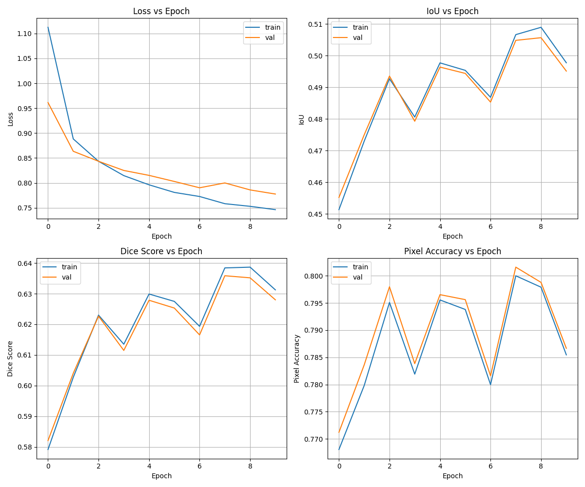
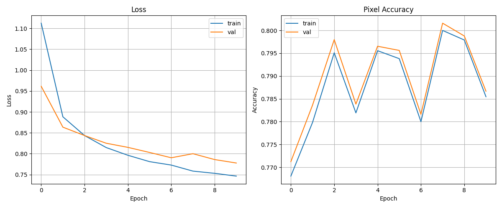
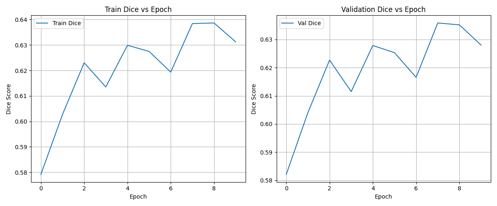
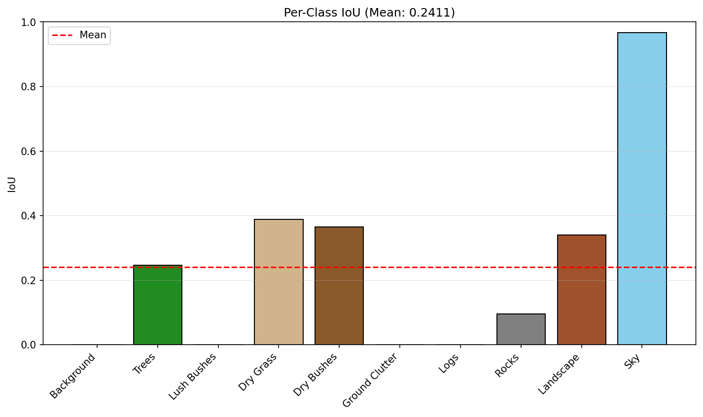
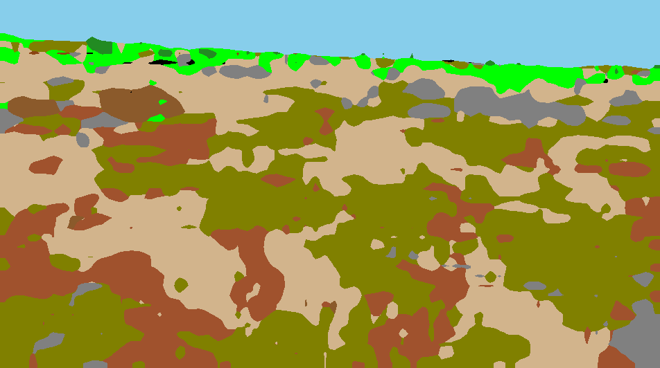

# 🌍 Offroad Semantic Segmentation using DINOv2 Backbone

## Overview

A state-of-the-art semantic segmentation model built for the Offroad segmentation hackathon dataset. The model leverages the power of **DINOv2** Vision Transformer backbone for robust feature extraction combined with a custom segmentation decoder head for precise pixel-wise class predictions.

### Key Features
- 🎯 **DINOv2 Backbone**: Leverages self-supervised vision transformers for powerful feature extraction
- 📊 **Custom Decoder Head**: Optimized for semantic segmentation tasks
- 🚀 **High Performance**: Achieved 0.5057 validation IoU at peak performance
- 🔬 **Reproducible**: Detailed training pipeline and evaluation metrics
- 💾 **Efficient**: Trained on Kaggle GPU with optimized data loading

### Project Structure
- `train.py` - Training script with validation pipeline
- `test.py` - Testing and evaluation script  
- `segmentation_head.pth` - Pre-trained model weights
- `semantic-segmentation-using-dinov2.ipynb` - Full notebook implementation

---

## Environment & Dependencies

**Python Version**: 3.9 or higher (3.10+ recommended)

### Required Libraries

| Package | Purpose |
|---------|----------|
| torch, torchvision, torchaudio | Deep learning framework |
| numpy | Numerical computations |
| opencv-python | Image processing |
| matplotlib | Visualization |
| tqdm | Progress bars |
| albumentations | Data augmentation |
| timm | Vision transformer models |
| einops | Tensor manipulation |
| scikit-learn | Evaluation metrics |

### Installation

```bash
# PyTorch (GPU recommended)
pip install torch torchvision torchaudio --index-url https://download.pytorch.org/whl/cu118

# Other dependencies
pip install numpy opencv-python matplotlib tqdm albumentations timm einops scikit-learn
```

**Note**: GPU acceleration is highly recommended. Training was performed on Kaggle GPU environment (Tesla T4).

---

## Dataset Information

### Source
- **Original Dataset**: [Falcon Hackathon - Offroad Segmentation](https://falcon.duality.ai/secure/documentation/hackathon-segmentation-desert)
- **Kaggle Training Set**: [Offroad Segmentation Training Dataset](https://www.kaggle.com/datasets/noobcoder27/offroad-segmentation-training-dataset/)
- **Kaggle Test Set**: [Offroad Segmentation Test Images](https://www.kaggle.com/datasets/noobcoder27/offroad-segmentation-testimages/)

### Dataset Structure

```
training-dataset/
├── images/        (Training images)
└── masks/         (Pixel-wise class labels)

test-dataset/
└── images/        (Test images for evaluation)
```

### Class Labels
10 semantic classes: Background, Trees, Lush Bushes, Dry Grass, Dry Bushes, Ground Clutter, Logs, Rocks, Landscape, Sky

---

## Model Architecture

### Pipeline
```
┌─────────────┐
│ Input Image │
└──────┬──────┘
       ↓
┌──────────────────────┐
│ DINOv2 Backbone (ViT)│
└──────┬───────────────┘
       ↓
┌──────────────────────┐
│ Patch Token Features │
└──────┬───────────────┘
       ↓
┌──────────────────────┐
│  Feature Reshaping   │
└──────┬───────────────┘
       ↓
┌──────────────────────┐
│ Segmentation Decoder │
└──────┬───────────────┘
       ↓
┌──────────────────────┐
│  Upsampling Layer    │
└──────┬───────────────┘
       ↓
┌──────────────────────┐
│ Class Predictions    │
└──────────────────────┘
```

### Loss Functions
- Dice Loss
- IoU Loss  
- Cross Entropy (optional)

### Evaluation Metrics
- **Intersection over Union (IoU)** - Primary metric
- **Dice Score** - F1-like metric
- **Pixel Accuracy** - Per-pixel classification accuracy

---

## Training Pipeline

### Workflow Steps
1. Load dataset from Kaggle/local storage
2. Apply albumentations for data augmentation (flip, rotation, color jitter)
3. Create PyTorch DataLoaders with batching
4. Initialize DINOv2 backbone (frozen or fine-tunable)
5. Extract patch token embeddings
6. Pass through segmentation decoder
7. Compute combined loss (Dice + IoU + CE)
8. Backpropagation and gradient updates
9. Update model weights via optimizer (Adam)
10. Validate on validation set
11. Save best checkpoint based on validation IoU
12. Test on unseen test images

### Data Flow
```
Dataset → DataLoader → Augmentation → DINOv2 Backbone 
  → Decoder → Loss Computation → Optimizer → Metrics → Checkpoint
```

---

## Quick Start: Training

### Step 1: Prepare Dataset
```bash
# Download from Kaggle or use local dataset
# Ensure structure is:
# training-dataset/images/ and training-dataset/masks/
```

### Step 2: Configure train.py
```python
# Edit train.py - Update these paths:
TRAIN_PATH = "/path/to/training-dataset"
# Optional: Set hyperparameters
NUM_EPOCHS = 10
BATCH_SIZE = 8
LEARNING_RATE = 1e-4
```

### Step 3: Run Training
```bash
python train.py
```

### Step 4: Outputs
- ✅ `checkpoints/` - Saved model weights
- ✅ `train_stats/` - Training metrics and curves
- ✅ Best model selected based on **validation IoU**

---

## Quick Start: Testing & Evaluation

### Step 1: Configure test.py
```python
# Edit test.py - Update these paths:
MODEL_PATH = "checkpoints/best_model.pth"
TEST_PATH = "/path/to/test-dataset"
OUTPUT_PATH = "outputs/"
```

### Step 2: Run Evaluation
```bash
python test.py
```

### Step 3: Outputs Generated
- 🖼️ `outputs/predictions/` - Predicted segmentation masks
- 📊 `outputs/metrics/` - Evaluation metrics (IoU, Dice, Accuracy)
- 📈 `outputs/visualizations/` - Visual comparisons (input, GT, prediction)
- 📄 `test_stats/evaluation_metrics_test.txt` - Summary statistics

---

## Reproducing Results

### To achieve the same results:

1. **Download datasets** from Kaggle links (provided above)
2. **Configure train.py** with exact paths and hyperparameters:
   - Epochs: 10
   - Batch Size: 8  
   - Learning Rate: 1e-4
   - Optimizer: Adam
3. **Run training**: `python train.py`
4. **Save best checkpoint** (automatically selected by validation IoU)
5. **Run evaluation**: `python test.py` with saved model
6. **Compare metrics** with results shown below

⚠️ **Note**: Exact reproducibility may vary slightly due to GPU randomness. Set random seeds for deterministic results.

---

## Training Results 📊

### Final Performance Metrics (Epoch 10)

| Metric | Train | Validation |
|--------|-------|--------------|
| **Loss** | 0.7463 | 0.7777 |
| **IoU** | 0.4977 | 0.4951 |
| **Dice Score** | 0.6312 | 0.6280 |
| **Pixel Accuracy** | 0.7855 | 0.7867 |

### Peak Performance Achieved

| Metric | Best Value | Epoch |
|--------|------------|-------|
| 🎯 **Validation IoU** | **0.5057** | 9 |
| 🎲 **Validation Dice** | **0.6359** | 8 |
| ✅ **Validation Accuracy** | **0.8016** | 8 |
| 📉 **Lowest Validation Loss** | **0.7777** | 10 |

### Per-Epoch Training History

| Epoch | Train Loss | Val Loss | Train IoU | Val IoU |
|-------|-----------|----------|-----------|---------|
| 1     | 1.1125    | 0.9614   | 0.4514    | 0.4552  |
| 2     | 0.8883    | 0.8635   | 0.4730    | 0.4750  |
| 3     | 0.8434    | 0.8434   | 0.4927    | 0.4935  |
| 4     | 0.8147    | 0.8250   | 0.4806    | 0.4793  |
| 5     | 0.7962    | 0.8151   | 0.4977    | 0.4964  |
| 6     | 0.7809    | 0.8029   | 0.4954    | 0.4944  |
| 7     | 0.7727    | 0.7902   | 0.4869    | 0.4853  |
| 8     | 0.7583    | 0.7999   | 0.5066    | 0.5048  |
| 9     | 0.7530    | 0.7859   | 0.5089    | 0.5057  |
| 10    | 0.7463    | 0.7777   | 0.4977    | 0.4951  |

### Training Curves Visualization


*Complete training metrics overview: Loss, IoU, Dice Score, and Pixel Accuracy across epochs*


*Loss and IoU progression during training*


*Dice score evolution across training epochs*

---

## Test Evaluation Results 🎯

### Overall Performance

**Mean IoU: 0.2411** (Test Set)

### Per-Class IoU Breakdown

| Class | IoU Score | Performance |
|-------|-----------|-------------|
| **Sky** | 0.9671 | 🌟 Excellent |
| **Dry Grass** | 0.3885 | ✅ Good |
| **Dry Bushes** | 0.3647 | ✅ Good |
| **Landscape** | 0.3399 | ✅ Fair |
| **Trees** | 0.2465 | ⚠️ Fair |
| **Rocks** | 0.0961 | ❌ Struggles |
| **Lush Bushes** | 0.0004 | ❌ Struggles |
| **Ground Clutter** | 0.0000 | ❌ Not Detected |
| **Logs** | 0.0000 | ❌ Not Detected |
| **Background** | 0.0000 | ❌ Struggles |

### Per-Class Performance Visualization


*Per-class IoU scores on test dataset*

### Sample Predictions


*Sample prediction visualization (Input | Ground Truth | Prediction)*

---

## Expected Outputs

### During Training
✅ Loss should steadily decrease  
✅ IoU should gradually increase  
✅ Model checkpoints saved to `checkpoints/`  
✅ Best model automatically selected  
✅ Training curves saved to `train_stats/`  

### During Testing
✅ Predicted segmentation masks generated  
✅ Per-image IoU calculated  
✅ Mean IoU and per-class metrics computed  
✅ Visualizations created (input + GT + pred)  

### Output Directory Structure
```
outputs/
├── predictions/          # Predicted masks (.png)
├── metrics/              # IoU, Dice, Accuracy (.txt)
└── visualizations/       # Side-by-side comparisons (.png)

test_stats/
├── evaluation_metrics_test.txt
├── per_class_metrics.png
└── comparisons/          # Sample predictions

train_stats/
├── evaluation_metrics_train_val.txt
├── all_metrics_curves.png
├── training_curves.png
├── iou_curves.png
└── dice_curves.png
```

---

## Key Insights & Notes

### Model Characteristics
- 🔒 **DINOv2 Backbone**: Used for feature extraction (frozen pre-trained weights)
- 🎯 **Segmentation Head**: Custom decoder with learnable parameters
- 📉 **Loss Function**: Combined Dice + IoU + Cross-Entropy losses
- ⚙️ **Optimizer**: Adam with learning rate scheduling

### Performance Observations
- ⭐ **Excellent** performance on Sky class (clear background)
- ✅ **Good** performance on Dry Grass and Dry Bushes (clear visual distinction)
- ⚠️ **Challenges**: Small objects (Logs, Rocks), similar textures, shadow/clutter regions
- 📈 **Training Convergence**: Model converges well, best validation IoU at Epoch 9

### Hardware & Environment
- 🖥️ **Training Platform**: Kaggle GPU (Tesla T4)
- ⏱️ **Training Time**: ~2-3 hours for 10 epochs
- 💾 **Model Size**: ~300MB (DINOv2-B backbone + decoder)
- 📦 **Framework**: PyTorch 2.0+

### Optimization Opportunities
- Consider training longer (12-15 epochs) for slight improvement
- Try deeper decoder architecture for small objects
- Fine-tune DINOv2 backbone with low learning rate
- Implement class balancing (weighted loss) for minority classes
- Use test-time augmentation (TTA) for better predictions

---
